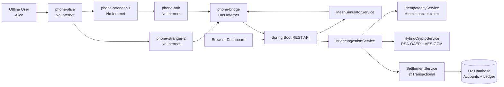
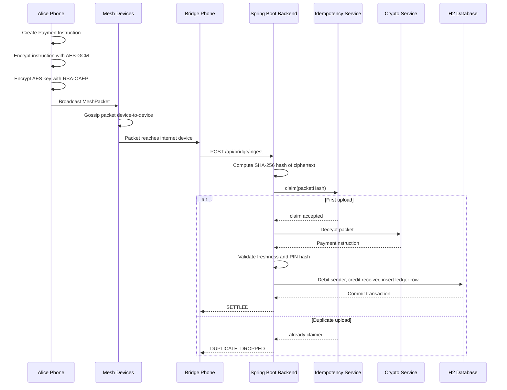

# RupeeRelay

**Offline UPI Mesh Payment Settlement System**

RupeeRelay is a Java Spring Boot project that demonstrates how an offline UPI-style payment can be securely created, relayed through nearby devices, uploaded later by an internet-connected bridge phone, and settled exactly once by the backend.

The project simulates a real-world situation: a user is in a basement with no internet, sends Rs. 500 to a friend, and the encrypted payment packet travels through a Bluetooth-style mesh network until a bridge device reaches the internet and uploads it to the backend.

---

## What Is This Project?

RupeeRelay is a backend plus browser dashboard that demonstrates:

- Offline payment packet creation
- Hybrid encryption using real Java crypto APIs
- Device-to-device mesh packet gossip
- Bridge upload to a backend server
- Idempotent payment ingestion
- Replay protection
- Tamper detection
- Stale packet rejection
- Transactional settlement using Spring Data JPA
- A visual dashboard to demonstrate the complete payment flow

This is not a production UPI system. It is a technical prototype built to show backend engineering concepts used in payment systems, distributed systems, and secure transaction processing.

---

## What We Developed

We developed a complete Spring Boot application named `upi-offline-mesh` with:

- Java 17 compatible Spring Boot backend
- Maven project setup with wrapper scripts
- H2 in-memory database
- JPA entities for accounts and transaction ledger
- Hybrid RSA + AES-GCM encryption layer
- Virtual mesh network simulator
- Bridge ingestion pipeline
- Idempotency service using atomic claims
- Transactional settlement service
- Browser dashboard using a Spring Boot served HTML template
- Login/logout demo flow
- JUnit 5 tests for replay, tampering, stale payments, and concurrent duplicates

The dashboard allows the user to:

- Log in using demo users
- View balances
- View transaction ledger
- View mesh devices
- Compose a payment
- Inject encrypted payment into the mesh
- Run gossip rounds
- Upload from bridge devices
- Replay packets
- Tamper packets
- Submit stale packets
- Reset the full demo

---

## Why We Developed This

Digital payments usually assume internet connectivity at the time of payment. But many real-world locations have poor or zero connectivity:

- Basements
- Metro stations
- Rural areas
- Crowded events
- Disaster zones
- Remote shops
- Underground parking areas

The idea behind RupeeRelay is to explore this question:

> Can a payment be created offline, carried securely through nearby devices, and settled later without duplicate settlement or tampering?

This project was developed to demonstrate how a backend can safely handle such delayed payment packets using encryption, idempotency, transactional settlement, and replay protection.

---

## Problems Solved

### 1. No Internet at Payment Time

The sender does not need internet while creating the payment. The payment is encrypted locally and injected into a virtual mesh network.

### 2. Secure Packet Transport Through Unknown Devices

Nearby devices can carry the packet, but they cannot read or modify the payment instruction. The instruction is encrypted for the backend using hybrid encryption.

### 3. Tamper Detection

If any byte of the encrypted packet is changed, AES-GCM authentication fails during decrypt. The backend rejects the packet and does not touch the ledger.

### 4. Duplicate Uploads

The same packet may reach the backend multiple times through gossip or replay. The backend computes a SHA-256 hash of the ciphertext and claims it atomically before decrypting.

Duplicate packets return:

```text
DUPLICATE_DROPPED
```

### 5. Replay Attacks

Uploading the same valid packet again does not debit the sender again. The idempotency layer drops it before decrypting or settlement.

### 6. Stale Payments

Packets older than 24 hours are rejected:

```text
STALE_REJECTED
```

### 7. Exactly-Once Settlement

Settlement runs inside a database transaction. The sender is debited, receiver is credited, and the ledger row is inserted together. A unique constraint on `packetHash` provides an additional database-level guard.

---

## Tech Stack

- Java 17
- Spring Boot 3.3.5
- Spring Web
- Spring Data JPA
- H2 in-memory database
- Maven
- Thymeleaf-compatible Spring template serving
- Plain HTML, CSS, and JavaScript dashboard
- Java Cryptography Architecture
- JUnit 5
- AssertJ

---

## Architecture Diagram



---

## Backend Package Structure

```text
com.demo.upimesh
├── controller
│   ├── DashboardController
│   └── ApiController
├── crypto
│   ├── ServerKeyHolder
│   ├── HybridCryptoService
│   └── CryptoException
├── model
│   ├── Account
│   ├── Transaction
│   ├── PaymentInstruction
│   └── MeshPacket
├── repository
│   ├── AccountRepository
│   └── TransactionRepository
└── service
    ├── MeshSimulatorService
    ├── BridgeIngestionService
    ├── SettlementService
    ├── IdempotencyService
    ├── DemoDataInitializer
    ├── PinHasher
    └── VirtualDevice
```

---

## Flow Of The Project



---

## Working Of The Project

### 1. Login

The dashboard has a simple demo login system. No complex authentication is used because the focus is the payment pipeline.

Demo users:

```text
alice / 1234
bob / 1234
bridge / 1234
```

### 2. Payment Creation

The user enters:

- Sender UPI ID
- Receiver UPI ID
- Amount
- PIN

The backend creates a `PaymentInstruction` containing:

- `senderUpiId`
- `receiverUpiId`
- `amount`
- `pinHash`
- `nonce`
- `signedAt`

The plain PIN is never stored. For this demo, the PIN is stored and compared as a SHA-256 hash.

### 3. Hybrid Encryption

The payment instruction is encrypted using real Java crypto APIs:

1. Convert `PaymentInstruction` to JSON.
2. Generate a fresh AES-256 key.
3. Generate a 12-byte IV.
4. Encrypt the JSON using `AES/GCM/NoPadding`.
5. Encrypt the AES key using `RSA/ECB/OAEPWithSHA-256AndMGF1Padding`.
6. Concatenate:

```text
[RSA encrypted AES key][12 byte IV][AES-GCM ciphertext + tag]
```

7. Encode the final byte array as Base64.

Only the backend private key can decrypt the AES key. Unknown mesh devices can carry the packet but cannot read the payment.

### 4. Mesh Simulation

The project seeds virtual devices:

```text
phone-alice
phone-bob
phone-stranger-1
phone-stranger-2
phone-bridge
```

Only `phone-bridge` has internet.

When the user clicks `Inject into Mesh`, the encrypted packet is placed on `phone-alice`.

When the user clicks `Run Gossip Round`, each device shares packets with every other device. Duplicate ciphertexts are ignored per device. TTL decreases as packets hop.

### 5. Bridge Upload

When the user clicks `Bridges Upload to Backend`, internet-enabled devices upload their held packets to:

```text
POST /api/bridge/ingest
```

### 6. Backend Ingestion Pipeline

The backend follows this order:

1. Receive `MeshPacket`.
2. Compute SHA-256 hash of ciphertext.
3. Claim hash using `IdempotencyService`.
4. Drop duplicate before decrypting.
5. Decrypt ciphertext.
6. Reject tampered ciphertext if AES-GCM validation fails.
7. Reject stale packets older than 24 hours.
8. Validate sender PIN hash.
9. Settle payment inside a database transaction.

This order is important because duplicate packets should not waste decrypt work or risk touching settlement logic.

### 7. Settlement

`SettlementService` runs with `@Transactional`.

It:

- Debits sender balance
- Credits receiver balance
- Inserts a transaction ledger row
- Uses optimistic locking through `@Version` on `Account`
- Uses a unique constraint on `packetHash`

If the sender does not have enough balance, settlement is rejected.

---

## Demo Scenario

Initial balances:

| User | UPI ID | Balance |
| --- | --- | --- |
| Alice | `alice@upi` | Rs. 5000 |
| Bob | `bob@upi` | Rs. 1000 |
| Charlie | `charlie@upi` | Rs. 2000 |

Demo payment:

```text
Alice sends Rs. 500 to Bob
```

Expected result after bridge upload:

| User | Final Balance |
| --- | --- |
| Alice | Rs. 4500 |
| Bob | Rs. 1500 |

The ledger contains exactly one settled transaction.

If the same packet is uploaded again, balances do not change and the result is:

```text
DUPLICATE_DROPPED
```

---

## Dashboard Controls

| Button | Purpose |
| --- | --- |
| `Inject into Mesh` | Creates encrypted payment packet and places it on `phone-alice` |
| `Run Gossip Round` | Shares packets across virtual devices |
| `Bridges Upload to Backend` | Uploads packets from internet-enabled bridge devices |
| `Replay Packet` | Sends the same ciphertext again to prove idempotency |
| `Tamper Packet` | Flips one encrypted byte to prove AES-GCM tamper rejection |
| `Stale Packet` | Uploads an old packet to prove freshness validation |
| `Reset Mesh` | Restores accounts, ledger, packets, and idempotency claims |

---

## API Endpoints

| Method | Endpoint | Description |
| --- | --- | --- |
| `POST` | `/api/demo/login` | Demo login |
| `POST` | `/api/demo/logout` | Demo logout |
| `GET` | `/api/demo/state` | Current dashboard state |
| `POST` | `/api/demo/inject` | Create and inject encrypted packet |
| `POST` | `/api/demo/gossip` | Run one mesh gossip round |
| `POST` | `/api/demo/bridge-upload` | Upload bridge-held packets |
| `POST` | `/api/demo/reset` | Reset demo data |
| `POST` | `/api/demo/tamper` | Submit tampered packet |
| `POST` | `/api/demo/stale` | Submit stale packet |
| `POST` | `/api/demo/replay` | Replay last packet |
| `POST` | `/api/bridge/ingest` | Backend bridge ingestion endpoint |

---

## Installation

### Prerequisites

Install:

- Java 17 or newer
- Maven, optional because the project includes Maven wrapper
- VS Code, optional
- Java extensions for VS Code, optional

Recommended VS Code extensions:

- Extension Pack for Java
- Spring Boot Extension Pack

Check Java:

```bash
java -version
```

---

## How To Run

Open a terminal in the project root:

```text
C:\Users\UPI Project\upi-offline-mesh
```

### Windows

```bat
mvnw.cmd spring-boot:run
```

or:

```powershell
.\mvnw.cmd spring-boot:run
```

### macOS / Linux

```bash
./mvnw spring-boot:run
```

Then open:

```text
http://localhost:8080
```

---

## How To Run In VS Code

1. Open VS Code.
2. Open this folder:

```text
C:\Users\darsh\Desktop\UPI Project\upi-offline-mesh
```

3. Wait for Java and Maven indexing to finish.
4. Open:

```text
src/main/java/com/demo/upimesh/UpiOfflineMeshApplication.java
```

5. Click `Run` above the `main` method.

You can also run from the VS Code terminal:

```powershell
.\mvnw.cmd spring-boot:run
```

---

## Port Already In Use

If port `8080` is already in use, stop the existing process or run the app on another port.

Find the process:

```powershell
netstat -ano | findstr :8080
```

Stop it:

```powershell
taskkill /PID <PID_FROM_LAST_COLUMN> /F
```

Or run on a different port:

```powershell
.\mvnw.cmd spring-boot:run -Dspring-boot.run.arguments=--server.port=8081
```

Then open:

```text
http://localhost:8081
```

---

## How To Test

Run:

```bash
./mvnw test
```

On Windows:

```powershell
.\mvnw.cmd test
```

Test coverage includes:

- Concurrent duplicate upload handling
- Exactly-once settlement
- Replay rejection
- Tampered ciphertext rejection
- Stale packet rejection
- Ledger unchanged for invalid packets

---

## Database

The project uses H2 in-memory database.

H2 console:

```text
http://localhost:8080/h2-console
```

JDBC URL:

```text
jdbc:h2:mem:upimesh
```

Default user:

```text
sa
```

Password is empty.

---

## Key Learning Outcomes

This project demonstrates practical backend concepts useful for product-based company interviews:

- Designing secure payment-like workflows
- Building idempotent APIs
- Handling replay attacks
- Using authenticated encryption
- Applying transactional consistency
- Modeling distributed message propagation
- Building a dashboard for system observability
- Writing tests for concurrency and security-sensitive behavior

---

## Project Status

Complete and runnable.

Implemented:

- Login/logout dashboard
- Account balance table
- Transaction ledger
- Virtual mesh devices
- Packet count per device
- Encrypted payment injection
- Gossip simulation
- Bridge upload
- Idempotent settlement
- Replay rejection
- Tamper rejection
- Stale packet rejection
- Reset flow
- JUnit test suite

